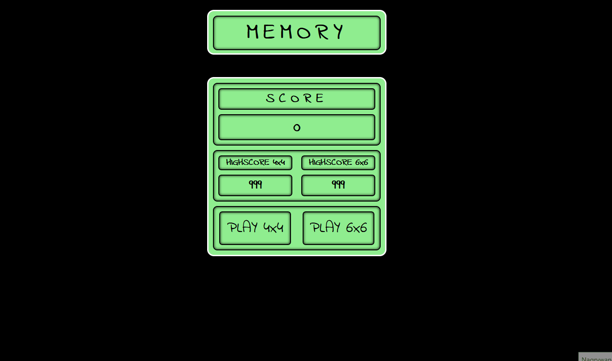

# MEMORY

MEMORY is aplication to play nad fun. I created it to train my skills in basic html, scss and Vanilla JS to have some fun from using it. This project was prepared without any framework. For styling I used pure scss styling. Structure of the project is very simple: index.html file with HTML code, style.scss file with styles and script.js file with all JS code.

## How it works

## Link
https://webster2020.github.io/BMI_CALCULATOR/

## Getting Started
1. git clone git@github.com:Webster2020/MEMORY.git
2. npm install
3. npm run watch - run the project and than You can see it on Your device

*...or use link if You only want to check how it works

Used technologies:
 1. Vanilla js without any framework with ES6+ standard
 2. Scss for styling
 3. HTML5 for content

Implemented solutions

 1. Content are divided into several parts:
  - part 'menu' putted in index.html in one container
  - part 'board' creating by button (4x4 or 6x6) click 
 2. Styles are divided into several parts:
  - constants
  - global
  - header
  - game board
  - results
  - @media
 3. JS code is divided to several functions and constants
 4. MEMORY functionalities:
  - MENU:
  - create board with 16 or 36 cards by button 'click'
  - calculate and display amount of 'clicks'
  - save high scores for both of board types
  - highlight button efect with mouse events
  - BOARD
  - rotate card efect nad change card color after 'click' on card
  - remove pair of cards which have the same color
  - box-shadow cards efect with mouse events

### Project architecture

Project is not diveded on component (like in e.g. React), because of its structure size is very simple:
 1. HTML - content of aplication
 2. SCSS - all styles
 3. JS - all functions and logic for aplication
 4. root file: index.html
 5. configuration files: gitignore, package.json etc.

### How did I create this project?

Project was prepared based on my own idea.

## Plan for future dvelopment

 - Creating bigger board with 64 cards
 - Refactoring code (focus on DRY principle)

## Authors

* **Michal Szwajgier** - *Webster2020* - 

## License
Free licence
